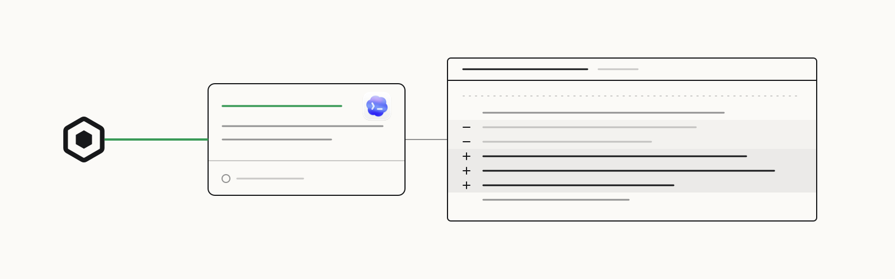

<p>
  <a href="https://openscout.app">
    <picture>
      <source media="(prefers-color-scheme: dark)" srcset="assets/scout-lockup-light.svg" />
      
    </picture>
  </a>
</p>

# Scout for Codex

Request a review or hand off work from Codex, follow the result, and continue the same work.

[Website](https://oscout.github.io/codex-scout/) · [Install](#install) · [First ask](#first-ask) · [OpenScout](https://openscout.app) · [All integrations](https://github.com/oscout)

<!-- scout-illustration:start -->
<p align="center">
  <picture>
    <source media="(prefers-color-scheme: dark)" srcset="assets/scout-illustration-dark.svg" />
    
  </picture>
</p>
<p align="center"><em>Request a review, follow its result, and continue the same work.</em></p>
<!-- scout-illustration:end -->

## Install

From Codex:

```text
/plugin marketplace add oscout/codex-scout
```

The marketplace declares the `scout` plugin as installed by default. If your
Codex build only adds the marketplace and the plugin does not appear in your
next session, enable it in `~/.codex/config.toml`:

```toml
[plugins."scout@openscout"]
enabled = true
```

For local development, point Codex at a checkout instead:

```text
/plugin marketplace add /absolute/path/to/codex-scout
```

## First ask

Ask in plain language from a Codex session:

```text
Use Scout to ask a Claude agent in /path/to/repo to review this diff.
Keep the returned work handle for follow-up.
```

The bundled Scout skill routes fresh work by project and harness, then
continues by the returned handle instead of guessing agent names.

## What it adds

- **The Scout MCP server**, launched by the `scout` plugin.
- **A Scout coordination skill** for agent discovery, direct messages, asks,
  session continuity, and work updates.

## How it works

The plugin starts Scout's MCP server through `scripts/run-scout-mcp.sh`, which:

- prefers a locally installed `scout` CLI
- falls back to `bunx @openscout/scout`
- defaults `OPENSCOUT_SETUP_CWD` from Codex/workspace environment variables or
  `$PWD` when the host has not already set a Scout context root
- uses `$HOME` only as the last fallback

Advanced overrides:

- set `OPENSCOUT_SETUP_CWD` to force Scout's default workspace root
- set `OPENSCOUT_MCP_BIN` to force a specific Scout executable

## Requirements

- A local OpenScout broker
- The `scout` CLI, or Bun so the wrapper can run `bunx @openscout/scout`

## Notes

This is an experimental local developer package. The project page lives at
[`docs/index.html`](./docs/index.html) and is served by GitHub Pages from the
`docs/` folder on `main`.
